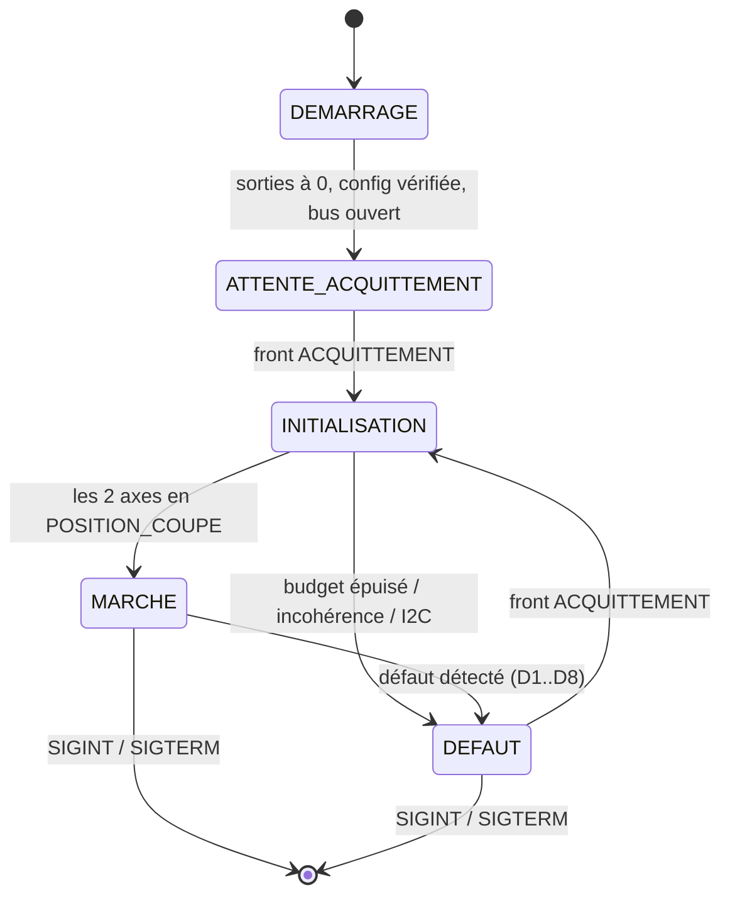
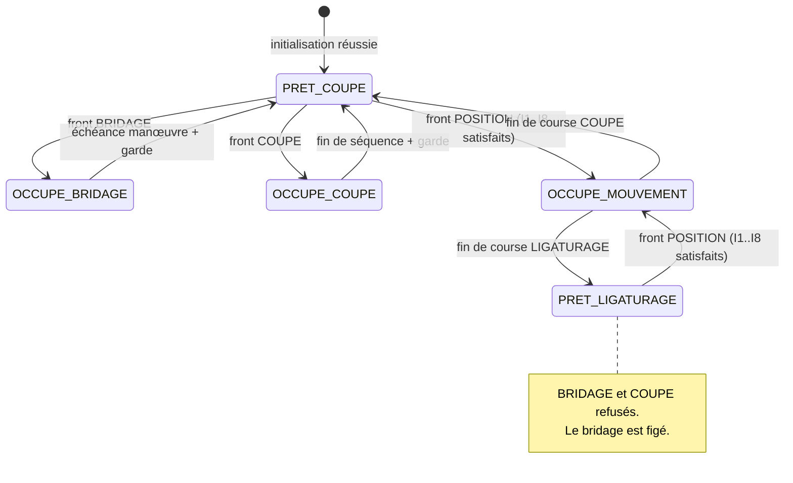

# Vitis Optima — indus V2 · Document de logique

Version 2 — 2026-09-24. Validée le 2026-09-24, puis complétée pendant le codage :
les compléments sont listés au § 15.

Ce document fige la logique de pilotage du prototype indus V2. Il est la référence :
`config.py` porte les valeurs, le code implémente ce qui est écrit ici, rien d'autre.

---

## 1. La machine en une page

Deux postes symétriques, **mère** et **fille**. Chacun possède :

- un **bridage** (EV, 1 bobine) — maintient le bois de vigne,
- une **coupe** (EV, 1 bobine) — descend la lame puis la remonte,
- un **axe** NEMA 34 + driver JK-DM860H, qui bascule entre deux positions :
  **POSITION_COUPE** et **POSITION_LIGATURAGE**, chacune matérialisée par une fin de course.

Trois boutons par poste : **BRIDAGE**, **COUPE**, **POSITION**. Plus un bouton
**ACQUITTEMENT** commun. Aucun voyant. Un buzzer.

L'arrêt d'urgence est câblé en dur et coupe tout, y compris la Raspberry Pi. Le logiciel
ne le voit pas : au réarmement, le programme repart de zéro.

---

## 2. Choix d'architecture

### 2.1 Ce que fait V1 : l'action gardée

V1 ([indus/vitis_optima.py](../indus/vitis_optima.py)) n'a pas d'état explicite. Chaque
appui appelle une méthode qui vérifie ses gardes puis agit :

```python
def lancer_coupe(self):
    if not self.initialisee: ... return
    if self.coupe_active:    ... return
    if cfg.EXIGER_POSITION_AVANT_COUPE and self.position != "basse": ... return
    # agit
```

C'est lisible et suffisant pour trois boutons indépendants sans moteur.

### 2.2 Pourquoi ça ne suffit plus

Quatre choses ont changé, et chacune casse le modèle de V1 :

1. **Les actions durent.** Un mouvement dure plusieurs secondes, une coupe environ deux.
   Pendant ce temps il faut continuer à scruter les entrées et à surveiller les capteurs.
   V1 fait `time.sleep()` au milieu d'une action (`_commander_position`) — impensable ici.
2. **Les postes se contraignent mutuellement.** L'ordre maître/esclave est une règle qui
   ne vit dans aucun des deux postes : il lui faut un arbitre.
3. **Il existe un état DÉFAUT verrouillé.** V1 n'a pas d'état absorbant.
4. **Tu demandes une protection contre la désynchronisation** entre la variable d'état et
   la réalité physique du vérin. La seule façon robuste d'y arriver est de rendre la durée
   de manœuvre explicite — donc d'avoir un état « en cours » distinct de l'état « fait ».

Le point 4 mérite qu'on s'y arrête, parce que c'est ta demande la plus structurante.

> « il faudra une protection universelle pour tous les boutons pour pas qu'on puisse
> appuyer trop vite et inverser l'état de la variable et la situation réelle (vérin de
> bridage en bas et variable notée en haut par exemple) »

En V1, `descendre()` écrit le bit **et** pose `self.position = "basse"` dans la même
instruction. Si l'opérateur réappuie 100 ms plus tard, le programme croit le vérin en bas
alors qu'il est encore à mi-course. La variable ment.

**La règle retenue : une commande d'actionneur n'est jamais instantanée.** Toute commande
ouvre une *action*, avec une durée déclarée en configuration. L'état de l'actionneur ne
change qu'à la **fin** de l'action. Pendant toute sa durée, le poste est **occupé** et tous
ses boutons sont ignorés. Cette règle est universelle : bridage, coupe, mouvement. Aucune
exception, y compris pour le bridage qui n'est pourtant qu'un changement de bit.

### 2.3 L'architecture retenue

**Une machine à états par poste, plus un coordinateur.** C'est ce que tu proposais, et je
le recommande — pour les quatre raisons ci-dessus, pas par goût de l'abstraction.

La répartition est stricte :

| Qui | Décide de quoi | Ne sait rien de |
|---|---|---|
| **Poste** (`libs/poste.py`) | son bridage, sa coupe, son axe, ses gardes internes | l'autre poste, le défaut global |
| **Coordinateur** (`libs/machine.py`) | état global, initialisation, défaut, règles inter-postes | le détail des actions d'un poste |

Le coordinateur autorise ou refuse une demande de mouvement ; il ne la pilote pas. Un poste
n'appelle jamais l'autre poste. Cette contrainte est ce qui garde le code lisible.

**Ce que je ne fais pas** : pas de bibliothèque de machines à états, pas de classe de base
abstraite, pas d'injection de dépendances. Un `if / elif` sur une chaîne d'état, lisible de
haut en bas.

### 2.4 Génération des impulsions : un thread par axe

C'est la seule entorse à la simplicité, et elle est justifiée par l'arithmétique.

À 1200 pas/s, un pas dure 833 µs. Une lecture I2C coûte 400 à 800 µs en pratique. Lire le
capteur entre deux pas est donc impossible. Trois options existaient ; je retiens **un
thread par axe** :

- le thread génère les impulsions et exécute le profil de vitesse,
- la boucle principale lit les capteurs à 250 Hz et pose un **drapeau d'arrêt**,
- le thread teste le drapeau à chaque pas — un test de booléen, quelques dizaines de
  nanosecondes — et s'arrête net.

Le thread ne touche **aucune** sortie via I2C : DIR et ENA sont écrits par la boucle
principale *avant* son démarrage, et remis par elle *après* sa fin. Le thread ne possède
que la broche PUL, qui n'appartient à personne d'autre. Il n'y a donc **aucune ressource
partagée en écriture** entre le thread et la boucle, hormis quatre valeurs écrites chacune
d'un seul côté : le drapeau d'arrêt, la consigne de surcourse et la borne de budget
(écrits par la boucle), le compteur de pas (écrit par le thread). Pas de verrou, pas de
file, pas de course critique.

Conséquence chiffrée : à 250 Hz, la latence de décision est de 4 ms par lecture. Avec
deux lectures consécutives exigées pour arrêter (`CAPTEUR_LECTURES_ARRET`), cela fait
≈ 5 pas à 600 pas/s et ≈ 1 pas à vitesse d'approche. Très en dessous de ta limite de 10°.

Deux réglages de l'interpréteur Python protègent la régularité des impulsions :
`sys.setswitchinterval(0,5 ms)` pour que le thread récupère la main dès que son pas
arrive à échéance, et `gc.freeze()` après le démarrage pour qu'une passe du
ramasse-miettes ne fige pas le thread.

---

## 3. États

### 3.1 État global



En **DEMARRAGE**, dans cet ordre : `verifier_config()`, ouverture du bus, configuration des
trois MCP, **écriture immédiate des relais à 0 et de ENA à 1**, claim des broches PUL à 0.
Rien d'autre ne peut se produire avant.

En **ATTENTE_ACQUITTEMENT** et en **DEFAUT**, le seul bouton lu est ACQUITTEMENT. Les six
boutons d'action sont scrutés (anti-rebond, compteur de refus) mais n'ont aucun effet.

### 3.2 État d'un poste

Actif uniquement en **MARCHE**. Deux variables orthogonales : l'état de séquence et l'état
de bridage.



L'état de bridage est porté à part : `DEBRIDE` → `EN_MANOEUVRE` → `BRIDE`, et retour. Il ne
change qu'à l'échéance de la manœuvre — c'est la protection du § 2.2.

### 3.3 Séquence de coupe

Trois temps, comme demandé, avec les deux attentes encadrant l'impulsion :

```
front COUPE accepté
   │
   ├─ TEMPS_AVANT_COUPE_S ......... EV coupe à 0, on ne fait rien
   ├─ TEMPS_COUPE_S .............. EV coupe à 1 (lame descend)
   ├─ TEMPS_APRES_COUPE_S ........ EV coupe à 0 (lame remonte), on attend
   └─ TEMPS_GARDE_APRES_ACTION_S . poste toujours occupé
                                   → double bip, compteur+1, retour PRET_COUPE
```

L'attente d'avant sert à laisser l'opérateur dégager la main après l'appui. Celle d'après
garantit que la lame est remontée avant qu'un nouvel appui soit accepté.

---

## 4. Table des transitions

Notation : `now` = `time.monotonic()`. `poste.libre_a` = instant à partir duquel le poste
accepte à nouveau un appui.

### 4.1 Global

| # | État | Événement | Conditions | Actions | État suivant |
|---|---|---|---|---|---|
| G1 | DEMARRAGE | — | config valide, 3 MCP répondent | relais←0, ENA←1, PUL←0, journal | ATTENTE_ACQUITTEMENT |
| G2 | DEMARRAGE | — | config invalide ou MCP muet | journal, code retour ≠ 0 | *sortie* |
| G3 | ATTENTE_ACQUITTEMENT | front ACQUITTEMENT | — | bip, compteur+1 | INITIALISATION |
| G4 | INITIALISATION | axe esclave en POSITION_COUPE | — | lancer référencement maître | INITIALISATION |
| G5 | INITIALISATION | axe maître en POSITION_COUPE | esclave déjà référencé | postes ← PRET_COUPE, double bip, journal | MARCHE |
| G6 | INITIALISATION | défaut D1/D2/D3/D6/D8 | — | arrêt axes, ENA←1, relais←0, bip long | DEFAUT |
| G7 | MARCHE | défaut D1..D8 | — | idem G6 | DEFAUT |
| G8 | DEFAUT | front ACQUITTEMENT | — | bip, compteur+1, journal | INITIALISATION |
| G9 | * | SIGINT / SIGTERM | — | relais←0, ENA←1, PUL←0, fermeture bus | *sortie* |

**Initialisation séquentielle, esclave puis maître.** L'ordre découle de la règle de retour
(§ 5, I8) : c'est l'esclave qui revient le premier en POSITION_COUPE. Référencer dans
l'autre ordre créerait une situation que la marche normale n'autorise jamais.

Référencement d'un axe, dans l'ordre :

1. fin de course COUPE active → rien à faire ;
2. fin de course LIGATURAGE active → mouvement borné LIGATURAGE → COUPE ;
3. aucune active (cas courant, arrêt en pleine course) → recherche à vitesse d'approche
   vers COUPE, budget `MOTEUR_BUDGET_PAS` ;
4. budget épuisé sans capteur COUPE → **D8**.

### 4.2 Poste (en MARCHE uniquement)

| # | État | Événement | Conditions | Actions | État suivant |
|---|---|---|---|---|---|
| P1 | PRET_COUPE | front BRIDAGE | `now ≥ libre_a` | EV bridage ← inverse, `libre_a ← now + manœuvre + garde`, bip | OCCUPE_BRIDAGE |
| P2 | OCCUPE_BRIDAGE | `now ≥ libre_a` | — | bridage ← BRIDE/DEBRIDE, double bip, compteur EV+1 | PRET_COUPE |
| P3 | PRET_COUPE | front COUPE | `now ≥ libre_a` | ouvrir séquence de coupe, bip | OCCUPE_COUPE |
| P4 | OCCUPE_COUPE | échéance de phase | — | phase suivante (avant → impulsion → après → garde) | OCCUPE_COUPE |
| P5 | OCCUPE_COUPE | `now ≥ libre_a` | EV coupe déjà à 0 | double bip, compteur EV+1 | PRET_COUPE |
| P6 | PRET_COUPE | front POSITION | I1..I7 satisfaits | DIR←ligaturage, ENA←0, pause, démarrer thread, bip | OCCUPE_MOUVEMENT |
| P7 | PRET_LIGATURAGE | front POSITION | I1..I3, I8 satisfaits | DIR←coupe, ENA←0, pause, démarrer thread, bip | OCCUPE_MOUVEMENT |
| P8 | OCCUPE_MOUVEMENT | fin de course cible active sur `CAPTEUR_LECTURES_ARRET` lectures brutes consécutives | — | surcourse de `MOTEUR_SURCOURSE_DEG`, fin du thread, confirmation par le signal stable (≤ `CONFIRMATION_CAPTEUR_MAX_S`, sinon D5), ENA←1, `libre_a ← now + garde`, double bip, compteur axe+1 | PRET_LIGATURAGE / PRET_COUPE |
| P9 | OCCUPE_MOUVEMENT | budget de pas épuisé | — | *voir D1* | → DEFAUT |
| P10 | * | front sur un bouton du poste | garde non satisfaite | compteur refus+1, bip de refus | *inchangé* |

Note sur P8 : **ENA repasse à 1 (moteur libre) à l'arrêt.** L'axe n'a pas besoin de couple
de maintien en position, la fin de course ne bouge pas toute seule, et deux NEMA 34 excités
en permanence dissipent une vingtaine de watts dans le coffret. Si les essais montrent que
l'axe dérive sous l'effort de ligaturage, une variable `MOTEUR_MAINTIEN_EN_POSITION`
permettra d'inverser ce choix sans toucher au reste.

---

## 5. Table des interlocks

Vérifiés dans cet ordre. Le premier qui échoue arrête l'évaluation : appui ignoré,
compteur de refus incrémenté, bip de refus, ligne de journal.

| # | Interlock | Condition | S'applique à |
|---|---|---|---|
| **I1** | Machine en marche | `etat_global == MARCHE` | les 6 boutons d'action |
| **I2** | Poste disponible | `etat ∈ {PRET_COUPE, PRET_LIGATURAGE}` | les 3 boutons du poste |
| **I3** | Garde écoulée | `now ≥ poste.libre_a` | les 3 boutons du poste |
| **I4** | Coupe en position coupe seulement | `etat == PRET_COUPE` | bouton COUPE |
| **I5** | Bridage en position coupe seulement | `etat == PRET_COUPE` | bouton BRIDAGE |
| **I6** | **Bridé pour partir en ligaturage** | `bridage == BRIDE` | bouton POSITION, sens aller |
| **I7** | **Ordre à l'aller** | poste esclave : le maître est en position ligaturage **et** `now ≥ maitre.arrive_a + RETARD_SENS_ALLER_S`. Poste maître : l'esclave est en position coupe (garde défensive, voir plus bas) | bouton POSITION, sens aller |
| **I8** | **Ordre au retour** | poste maître : l'esclave est en position coupe (au repos, ou en train de brider / couper) | bouton POSITION, sens retour |

I4 et I5 sont redondants avec I2 tant que les seuls états disponibles sont PRET_COUPE et
PRET_LIGATURAGE. Je les écris quand même : ils expriment ta règle « en POSITION_LIGATURAGE,
COUPE et BRIDAGE verrouillés » explicitement, au lieu de la laisser émerger d'un effet de
bord.

**I7 — refus sec, pas de mémorisation.** Tant que le maître n'est pas arrivé et que le
retard n'est pas écoulé, l'appui sur POSITION côté esclave est refusé. Rien n'est mémorisé,
rien ne démarre en différé. Ce qui bouge est toujours ce qu'on vient de demander.
`RETARD_SENS_ALLER_S` est un délai **après l'arrivée** du maître.

**I8 — l'esclave revient en premier.** Le maître ne peut quitter POSITION_LIGATURAGE que si
l'esclave est déjà en POSITION_COUPE.

**Garde défensive de I7 côté maître.** Le maître ne part vers ligaturage que si l'esclave
est en position coupe. En marche normale, cette condition est toujours vraie (I7 et I8
l'imposent, voir ci-dessous) : elle ne se déclenche jamais. Elle est là pour qu'une erreur
future dans le code ne puisse pas envoyer le maître sur un esclave déjà en ligaturage.

### Vérification d'absence de blocage

Les quatre configurations possibles, avec ce que chaque poste peut faire :

| Maître | Esclave | Maître peut aller | Maître peut revenir | Esclave peut aller | Esclave peut revenir |
|---|---|---|---|---|---|
| COUPE | COUPE | **oui** (si bridé) | — | non (I7) | — |
| LIGAT. | COUPE | — | **oui** (I8 ok) | **oui** (I7 ok, si bridé) | — |
| LIGAT. | LIGAT. | — | non (I8) | — | **oui** |
| COUPE | LIGAT. | non (garde défensive I7) | — | — | **oui** |

Aucune ligne n'est entièrement « non » : **il n'existe pas de blocage**. Le cycle nominal
est : maître→LIG, esclave→LIG, esclave→COUPE, maître→COUPE.

La quatrième ligne n'est **pas atteignable** : l'esclave ne part que si le maître est en
ligaturage (I7), et le maître ne revient que si l'esclave est en coupe (I8). L'invariant
« esclave hors coupe ⇒ maître en ligaturage » est donc toujours vrai en marche. Après un
défaut, l'opérateur peut avoir bougé les axes à la main : c'est pourquoi la sortie de
défaut passe obligatoirement par une initialisation complète, qui ramène les deux axes en
COUPE. Même dans cette ligne, l'esclave peut revenir : pas de blocage.

---

## 6. Table des défauts

**Portée : globale.** Un défaut arrête les deux postes. Il n'y a qu'un opérateur et qu'un
bouton ACQUITTEMENT ; laisser un poste vivant pendant que l'autre est en défaut serait
difficile à raisonner et impossible à signaler sans voyants.

**Réaction commune, dans cet ordre :**
1. drapeau d'arrêt sur les deux threads, attente de leur fin (bornée à 200 ms) ;
2. **relais tous à 0** — bridage relâché, lames hautes ;
3. **ENA ← 1 sur les deux axes** — moteurs libres, comme demandé ;
4. bip long, ligne de journal avec le code et le contexte ;
5. `etat_global ← DEFAUT`.

**Sortie commune :** front ACQUITTEMENT → initialisation complète (G8). Aucune autre sortie.

| Code | Détection | Ce que ça signifie |
|---|---|---|
| **D1** | budget de pas épuisé sans atteindre la fin de course cible | axe bloqué, driver en panne, accouplement cassé, **ou fil de capteur coupé** |
| **D2** | les deux fins de course d'un même axe actives simultanément | court-circuit de câblage, ou déréglage mécanique d'un galet |
| **D3** | fin de course **cible** déjà active au moment de démarrer | capteur collé, ou position réelle incohérente avec l'état mémorisé |
| **D4** | fin de course **de départ** encore active après `MOTEUR_DEGAGEMENT_MAX_DEG` | **le moteur ne tourne pas** : driver en défaut, ENA mal câblé, alimentation de puissance absente |
| **D5** | fin de course absente plus de `TOLERANCE_PERTE_CAPTEUR_S` alors que le poste est à l'arrêt en position ; ou fin de course cible vue puis non confirmée dans `CONFIRMATION_CAPTEUR_MAX_S` | vibration, galet desserré, connecteur qui lâche, parasite |
| **D6** | `OSError` I2C après `I2C_RETRIES` tentatives | bus perturbé, nappe débranchée, MCP planté |
| **D7** | IODIR, GPPU ou latch de sortie relu ≠ attendu, deux relectures de suite | un MCP a perdu sa configuration (parasites des drivers) |
| **D8** | initialisation : un axe n'a pas atteint POSITION_COUPE | même causes que D1, au démarrage |

**D4 mérite une justification.** Le JK-DM860H n'a pas de sortie d'alarme : une panne de
driver n'est signalée que par une LED rouge dans le coffret. D4 est le seul détecteur
logiciel d'un moteur qui ne tourne pas, et il réagit en quelques dizaines de pas au lieu
d'attendre l'épuisement du budget complet.

Son seuil est de 20°, pas 10° : un axe arrêté par un défaut D1 peut se trouver jusqu'à
`MOTEUR_MARGE_DEG` au-delà de sa fin de course, galet toujours enfoncé. À la
réinitialisation, il lui faut donc jusqu'à la marge + la surcourse + le retard de
l'anti-rebond pour dégager son galet. Avec un seuil de 10°, D4 se serait déclenché à tort.
`verifier_config()` contrôle ce minimum. (Trouvé sur banc logiciel.)

**Le budget se compte depuis le relâchement du galet de départ.** Dès que la fin de
course de départ se relâche, l'axe est sur son point de déclenchement, à une course
nominale de la cible : le budget repart de là. La cible peut ainsi être dépassée d'au plus
`MOTEUR_MARGE_DEG`, où que l'axe ait démarré derrière son galet. Sans cela, un axe arrêté
par D1 se retrouvait à un budget entier de sa position coupe, et la réinitialisation
partait en D8 faute de pas. Le mouvement reste borné : D4 limite ce qui précède le
relâchement, le budget ce qui le suit. (Trouvé sur banc logiciel.)

**D7 : une relecture différente déclenche une reconfiguration et un avertissement ; deux
de suite déclenchent le défaut.** Un MCP dont le port de sortie repasse en entrée relâche
tous les relais — c'est mécaniquement sûr (bridage relâché, lames hautes) mais cela doit
être vu.

### Ce que la polarité des capteurs change

Tu as retenu le **contact NO, actif bas** : galet actionné = niveau 0, galet libre = 1,
**fil coupé = 1 = « pas en position »**.

C'est le bon choix, et il faut mesurer ce qu'il apporte : un capteur débranché ne peut
**jamais** produire un faux arrêt. Le moteur continue, épuise son budget, et part en D1
avec un message clair. Le mode de panne le plus probable est détecté de façon déterministe,
au lieu de dépendre d'une coïncidence entre deux capteurs.

Conséquence : **D2 cesse d'être le détecteur de rupture de fil** (il l'aurait été en
câblage NF). D2 reste utile — il attrape un court-circuit ou un galet déréglé — mais
l'essentiel du travail est fait par D1 et D4.

`CAPTEURS_ACTIFS_BAS = True`. À confirmer par `tests/test_3_capteurs.py` avant le premier
mouvement, en débranchant un connecteur pour vérifier le repli.

---

## 7. Mapping E/S final

Toutes les lignes marquées ⚠ doivent être vérifiées par les scripts de test avant le
premier mouvement.

### 7.1 MCP 0x24 — relais et boutons

`IODIRA = 0x00` (sorties) · `IODIRB = 0xFF` (entrées) · `GPPUB = 0xFF` (pull-ups internes)

| Bit | Signal | Sens | Constante | État sûr |
|---|---|---|---|---|
| GPA0 | *non câblé* | — | — | — |
| GPA1 | *non câblé* | — | — | — |
| GPA2 | relais 1 → **EV bridage mère** | sortie | `EV_BRIDAGE_MERE = 2` | 0 = débridé |
| GPA3 | relais 2 → **EV coupe mère** | sortie | `EV_COUPE_MERE = 3` | 0 = lame haute |
| GPA4 | relais 3 → **EV bridage fille** | sortie | `EV_BRIDAGE_FILLE = 4` | 0 = débridé |
| GPA5 | relais 4 → **EV coupe fille** | sortie | `EV_COUPE_FILLE = 5` | 0 = lame haute |
| GPA6 | relais 5 — libre | sortie | — | 0 |
| GPA7 | relais 6 — libre | sortie | — | 0 |
| GPB0 | bouton **BRIDAGE mère** ⚠ | entrée | `BTN_BRIDAGE_MERE = 0` | — |
| GPB1 | bouton **COUPE mère** ⚠ | entrée | `BTN_COUPE_MERE = 1` | — |
| GPB2 | bouton **POSITION mère** ⚠ | entrée | `BTN_POSITION_MERE = 2` | — |
| GPB3 | bouton **BRIDAGE fille** ⚠ | entrée | `BTN_BRIDAGE_FILLE = 3` | — |
| GPB4 | bouton **COUPE fille** ⚠ | entrée | `BTN_COUPE_FILLE = 4` | — |
| GPB5 | bouton **POSITION fille** ⚠ | entrée | `BTN_POSITION_FILLE = 5` | — |
| GPB6–7 | non câblés | entrée | — | — |

**GPA0 et GPA1 ne sortent nulle part sur ce PCB.** Les six relais sont sur A2..A7
(`Clean-and-Protech/V4/CLAUDE.md:155`, `libs/io_board.py:105`). `config.py` place
aujourd'hui les EV sur A0..A5 : **à corriger**.

Boutons NO vers la masse + pull-up interne → **appui = niveau 0**.
`BOUTONS_ACTIFS_BAS = True` — confirmé par V1, V4 et `old/test_7_boutons.py`.

### 7.2 MCP 0x25 — DIR et ENA

`IODIRA = 0x00` · `IODIRB = 0x00` (les deux ports en sorties)

| Bit | Signal | Constante | Remarque |
|---|---|---|---|
| GPA7 | **DIR driver 1 → axe mère** | `DIR_MERE = 7` | ⚠ câblage inversé du PCB |
| GPA6 | **DIR driver 2 → axe fille** | `DIR_FILLE = 6` | ⚠ idem |
| GPA0–5 | DIR drivers 3..8, inutilisés | — | laissés à 0 |
| GPB0 | **ENA driver 1 → axe mère** | `ENA_MERE = 0` | câblage direct |
| GPB1 | **ENA driver 2 → axe fille** | `ENA_FILLE = 1` | idem |
| GPB2–7 | ENA drivers 3..8, inutilisés | — | **forcés à 1** (libres) |

**Le port A est câblé à l'envers : DIR driver *n* est sur A(8−n).** Source : trois endroits
concordants dans V4 — `CLAUDE.md:145` et `:165`, l'en-tête de `libs/io_board.py:23`, et le
code `_dir_pin() = 8 - i` face à `_ena_pin() = i - 1`. `config.py` place aujourd'hui
`DIR_MERE = 0` et `DIR_FILLE = 1` : **à corriger**.

Polarité ENA — confirmée par `V4/config.py:104` (`ENA_ACTIVE_LEVEL = 0`) :

```
ENA = 0  →  driver actif   →  moteur EXCITÉ (couple de maintien)
ENA = 1  →  driver coupé   →  moteur LIBRE
```

Les six ENA inutilisés sont écrits à 1 dès le démarrage. Avant que Python ne tourne, les
broches du MCP sont en entrée et la pull-down force 0 : les huit drivers sont excités dès
la mise sous tension. Le programme le corrige immédiatement et le journalise.

### 7.3 MCP 0x26 — fins de course et acquittement

`IODIRA = 0xFF` · `IODIRB = 0xFF` (les deux ports en entrées) · `GPPUA = GPPUB = 0xFF`

| Bit | Signal | Constante |
|---|---|---|
| GPA4–7 | libres (câblés, disponibles) | — |
| GPA0–3 | non câblés | — |
| GPB0 | bouton **ACQUITTEMENT** (relevé le 2026-10-08) | `BTN_ACQUITTEMENT = 0` |
| GPB1–4 | les 4 **fins de course** (relevé le 2026-10-08 ; qui est qui : ⚠ test_3) | `CAP_*` |
| GPB5–7 | non câblés | — |

**Les quatre fins de course sont sur le même port, volontairement.** Un seul octet lu →
les quatre bits datent du même instant. La détection D2 (« les deux capteurs d'un axe
actifs ») porte alors sur une photo cohérente, pas sur deux lectures espacées de 400 µs.

Contact **NO** + pull-up → **en position = niveau 0**. `CAPTEURS_ACTIFS_BAS = True`.

Lecture : `GPIOA` et `GPIOB` sont lus en **une transaction de 2 octets** (auto-incrément du
MCP, `IOCON.SEQOP = 0`). Le 0x26 coûte donc une seule transaction par tour de boucle.

### 7.4 GPIO directs (BCM)

| BCM | Signal | Constante | État sûr |
|---|---|---|---|
| 17 | **PUL driver 1 → axe mère** | `PUL_MERE = 17` | 0 |
| 27 | **PUL driver 2 → axe fille** | `PUL_FILLE = 27` | 0 |
| 26 | **Buzzer** passif 5 V, 2 kHz | `BUZZER_GPIO = 26` | 0 |
| 16 | relais direct — **réservé** | `GPIO_RELAIS_LIBRE_1 = 16` | 0 |
| 20 | relais direct — **réservé** | `GPIO_RELAIS_LIBRE_2 = 20` | 0 |

Les relais 16 et 20 existent sur le PCB et ne sont pas utilisés. Le programme les claime en
sortie à 0 et ne les touche plus : ils sont ainsi dans un état connu et disponibles plus
tard, sans laisser de broche flottante.

Le driver latche sur le **front descendant** de PUL. L'étage de sortie étant non inverseur,
c'est la transition 1 → 0 du GPIO qui fait le pas.

`gpiochip` : candidats (4, 0) essayés dans l'ordre. Le RP1 est remonté de `gpiochip4` vers
`gpiochip0` sur les noyaux récents. Celui qui est retenu est journalisé au démarrage.

---

## 8. Profil de mouvement

Quatre phases, comme demandé :

```
vitesse
   │      ┌──────────────┐
MAX│     ╱                ╲
   │    ╱                  ╲
   │   ╱                    ╲
APP│──╱                      ╲──────────────────────╳  ← fin de course
   │                                                    (ou budget épuisé → D1)
   └────────────────────────────────────────────────── pas
     accél.      palier      décél.     approche lente
                                        (longueur non bornée a priori,
                                         bornée par le budget de pas)
```

La phase d'approche **stagne à `MOTEUR_VITESSE_APPROCHE_SPS`** jusqu'à ce que l'un des deux
se produise : la fin de course est atteinte (cas normal), ou le budget total est épuisé
(→ D1). C'est bien ce que tu décris.

Précisions :
- le moteur **démarre à la vitesse d'approche**, pas à zéro (un pas-à-pas ne démarre pas
  de 0) ;
- la décélération se termine `MOTEUR_DISTANCE_APPROCHE_DEG` **avant** la position
  nominale : si la course réelle est un peu plus courte que prévu, le galet est quand même
  atteint à vitesse lente ;
- une fois le galet détecté, l'axe parcourt encore `MOTEUR_SURCOURSE_DEG` (1°) pour
  s'asseoir franchement dessus. Sans cela, le rotor qui se recale à la coupure de ENA
  pourrait suffire à relâcher un galet atteint de justesse, et déclencher D5 ;
- la vitesse réelle est légèrement **inférieure** à la consigne : chaque période est
  comptée depuis le pas réellement émis. Un retard ralentit le moteur, il ne provoque
  jamais de rafale d'impulsions.

**Budget de pas** : `MOTEUR_COURSE_PAS + MOTEUR_MARGE_PAS`, compté depuis le relâchement
du galet de départ (§ 6). C'est une borne dure : le thread s'arrête de lui-même au dernier
pas autorisé. Aucun mouvement, y compris le référencement, n'en est dispensé.

### Contrainte à vérifier en configuration

Accélération et décélération consomment de la course. Avec les valeurs de mise au point
de `config.py` (course 90° → 800 pas ; 600 pas/s ; 3000 pas/s² ; approche 150 pas/s sur 5°) :

| Phase | Calcul | Pas | Degrés |
|---|---|---|---|
| accélération 150 → 600 | `(600²−150²)/(2×3000)` | 57 | 6,4° |
| palier à 600 | reste | 642 | 72,2° |
| décélération 600 → 150 | `(600²−150²)/(2×3000)` | 57 | 6,4° |
| approche lente | `MOTEUR_DISTANCE_APPROCHE_DEG` | 44 | 5,0° |

`verifier_config()` **refuse de démarrer** si accélération + décélération ne tiennent pas
dans la course moins l'approche. Le message indique quoi ajuster : monter
`MOTEUR_ACCEL_SPS2` / `MOTEUR_DECEL_SPS2` ou baisser `MOTEUR_VITESSE_MAX_SPS`.

---

## 9. Boucle principale

**250 Hz, non bloquante.** Aucun `time.sleep()` dans une action, jamais. Les seules attentes
bloquantes sont les micro-pauses de quelques millisecondes imposées par la fiche du driver
entre l'écriture de ENA, celle de DIR et le premier front.

Un tour de boucle :

```
1. lire 0x26 (1 transaction, 2 octets)   → 4 fins de course + acquittement
2. lire 0x24 port B (1 transaction)      → 6 boutons
3. anti-rebond + détection de fronts sur les 7 entrées
4. contrôles de cohérence capteurs       → D2, D4, D5
5. faire avancer le poste mère           (échéances, arrivées, fronts)
6. faire avancer le poste fille
7. écrire le port A du 0x24 SI l'octet a changé
8. faire avancer le buzzer               (non bloquant)
9. toutes les 2 s : relire les IODIR     → D7
10. dormir jusqu'au prochain top
```

Coût I2C : 2 lectures + au plus 1 écriture par tour, soit **≈ 600 transactions/s**, environ
25 % d'un bus à 100 kHz. Confortable.

**Anti-rebond des boutons** : par temps de stabilité, non bloquant — la méthode de V1, qui
est la bonne. Un changement n'est retenu qu'après `ANTI_REBOND_BOUTON_S` de stabilité.
Action sur **front d'appui uniquement** : un bouton maintenu ne répète jamais rien.

**Capteurs** : logique inverse, et c'est volontaire. On agit sur le **premier** front pour
arrêter le moteur immédiatement, puis on confirme par stabilité sur
`ANTI_REBOND_CAPTEUR_S`. Attendre la stabilité avant d'arrêter coûterait plusieurs degrés
de dépassement. Si la confirmation échoue, c'est **D5**.

### Politique d'erreur I2C

Simple et bornée, en deux niveaux :

1. **Dans le driver** — `I2C_RETRIES` nouvelles tentatives espacées de `I2C_RETRY_DELAY_S`,
   sur `OSError` uniquement.
2. **Au-dessus** — si le driver échoue malgré ses tentatives, c'est **D6** : défaut
   immédiat. Pas de reprise, pas de mode dégradé. Un bus qui ne répond plus veut dire qu'on
   ne sait plus ni lire les capteurs ni commander les relais.

Une seule exception, au chemin d'arrêt : si la remise à zéro des sorties échoue, on
journalise, on ferme le bus quand même, et on sort avec un code retour non nul. On ne peut
pas faire mieux, et il ne faut surtout pas masquer l'erreur d'origine.

---

## 10. Buzzer

Non bloquant, piloté par une petite file d'événements que la boucle fait avancer. Une
défaillance du buzzer n'interrompt jamais un cycle : toute erreur est avalée et
journalisée.

| Événement | Signal |
|---|---|
| appui **accepté** | 1 bip court (80 ms) |
| **fin d'action** (coupe, bridage, mise en position) | **2 bips courts** |
| appui **refusé** (interlock non satisfait) | 1 bip long (300 ms) |
| entrée en **DÉFAUT** | 1 bip très long (800 ms) |
| **initialisation terminée**, machine prête | 2 bips courts |

Le refus est délibérément un bip **long** et non un double bip court : c'est le double bip
qui signale la fin d'action, et les deux ne doivent pas se confondre à l'oreille.

---

## 11. Compteurs

Un compteur par bouton et un par actionneur, **pas de compteur global**, comme demandé.

```json
{
  "version": 1,
  "boutons": {
    "bridage_mere":   {"accepte": 0, "refuse": 0},
    "coupe_mere":     {"accepte": 0, "refuse": 0},
    "position_mere":  {"accepte": 0, "refuse": 0},
    "bridage_fille":  {"accepte": 0, "refuse": 0},
    "coupe_fille":    {"accepte": 0, "refuse": 0},
    "position_fille": {"accepte": 0, "refuse": 0},
    "acquittement":   {"accepte": 0, "refuse": 0}
  },
  "actionneurs": {
    "ev_bridage_mere":  0,
    "ev_coupe_mere":    0,
    "ev_bridage_fille": 0,
    "ev_coupe_fille":   0,
    "moteur_mere":      0,
    "moteur_fille":     0
  },
  "defauts": {"D1": 0, "D2": 0, "D3": 0, "D4": 0, "D5": 0, "D6": 0, "D7": 0, "D8": 0}
}
```

Un actionneur est incrémenté à la **fin** de sa manœuvre, pas à son lancement : le compteur
compte ce qui s'est réellement produit.

**Écriture atomique** : écriture dans `compteurs.json.tmp`, `flush()`, `os.fsync()`, puis
`os.replace()`. Sur POSIX, `os.replace()` est atomique : une coupure secteur laisse soit
l'ancien fichier intact, soit le nouveau complet, jamais un fichier tronqué.

**Cadence** : en mémoire pendant le fonctionnement, sur disque au plus une fois toutes les
`COMPTEURS_PERIODE_ECRITURE_S` (30 s par défaut) et systématiquement à l'arrêt et à l'entrée
en défaut. Une carte SD ne supporte pas une écriture par appui de bouton.

Le compteur de défauts n'est pas un compteur d'action, mais il est presque gratuit et
répond à la question « est-ce que ça arrive souvent ? » après quelques semaines.

---

## 12. Organisation des fichiers

Dossier `indus_V2/` autonome. Aucun import depuis `indus/`, aucun depuis V4 : les modules
utiles sont **recopiés et épurés**, avec l'origine en en-tête de fichier. À la racine :
seulement le programme, la configuration et la documentation.

```
indus_V2/
├── main.py               point d'entrée : démarrage sûr, boucle à 250 Hz, arrêt sûr
├── config.py             ⚠ SEUL fichier à modifier pour adapter la machine
├── LOGIQUE.md            ce document
├── README.md             installation, utilisation, procédure de test, dépannage
├── libs/
│   ├── materiel.py       bus I2C, MCP23017, puce GPIO, buzzer, chemin d'arrêt sûr
│   ├── entrees.py        boutons et fins de course : anti-rebond, fronts
│   ├── moteur.py         axe : ENA / DIR, thread d'impulsions, profil, budget de pas
│   ├── poste.py          machine à états d'un poste, interlocks I2–I6, défauts D1–D5, D8
│   ├── machine.py        coordinateur : état global, init, défaut, I1, I7, I8, D6, D7
│   └── journal.py        journal tournant + compteurs persistants
├── tests/
│   ├── _commun.py              outils partagés (pas un test)
│   ├── test_1_i2c.py           les 3 MCP répondent et gardent leur configuration
│   ├── test_2_boutons.py       les 7 boutons, affichage en direct
│   ├── test_3_capteurs.py      les 4 fins de course + repli au débranchement
│   ├── test_4_relais.py        les 4 EV une par une, séquence de coupe, chronométrage
│   ├── test_5_moteur.py        un axe : bon moteur, bon sens, arrêt capteur, profil
│   └── test_6_course.py        mesure de MOTEUR_COURSE_DEGRES
├── logs/                 vitis_optima.log + rotation (5 × 1 Mo) — créé au lancement
└── etat/
    └── compteurs.json    créé au lancement
```

Le « cycle complet » n'a pas de script dédié : c'est `main.py` lui-même, avec la
check-list du README § 4.4.

### Origine de chaque module

| Module | Repris de | Ce qui change |
|---|---|---|
| `libs/materiel.py` | V4 `libs/i2c_bus.py`, `libs/mcp23017.py`, `libs/gpio_handle.py`, `libs/buzzer.py` ; V1 `indus/mcp23017.py` | fusionnés ; retrait des exceptions typées et du scan de bus ; ajout de la lecture en bloc `GPIOA+GPIOB`, de la relecture de configuration, du choix de la puce GPIO par libellé ; buzzer rendu non bloquant |
| `libs/entrees.py` | V1 classe `Boutons` | élargi à 2 MCP, 7 boutons et 4 fins de course ; ajout du compteur de lectures consécutives pour l'arrêt moteur |
| `libs/moteur.py` | V4 `libs/moteur.py`, `libs/io_board.py` | boucle de pas passée en **thread** avec drapeau d'arrêt ; profil à 4 phases ; budget de pas extensible ; surcourse ; retrait de la résolution par nom métier et du homing V4 |
| `libs/poste.py`, `libs/machine.py` | V1 `indus/vitis_optima.py` | octet des relais composé depuis l'état, une lecture I2C par tour : repris. Les actions gardées deviennent une machine à états par poste + un coordinateur |
| `libs/journal.py` | V4 `logger.py` | `RotatingFileHandler` au lieu d'un fichier par lancement ; ajout des compteurs |
| `main.py` | V1 `indus/vitis_optima.py` | handlers de signaux + `finally` unique : repris tels quels |

---

## 13. Ce qui reste à mesurer sur la machine

Ce sont des valeurs de `config.py`, marquées ⚠. La procédure complète, dans l'ordre, est au
README § 4.

| Paramètre | Comment | Script |
|---|---|---|
| correspondance des 6 boutons + acquittement | appuyer un par un | `test_2_boutons.py` |
| correspondance et polarité des fins de course, repli au débranchement | mettre en position, débrancher | `test_3_capteurs.py` |
| correspondance des 4 relais et sens des EV | activer une par une | `test_4_relais.py` |
| `TEMPS_COUPE_S`, les deux attentes, `TEMPS_MANOEUVRE_BRIDAGE_S` | chronométrer | `test_4_relais.py` |
| `DRIVER_PAS_PAR_TOUR` | **lire l'étiquette du driver** | — |
| `DIR_MERE = 7` / `DIR_FILLE = 6`, `DIR_VERS_*` | le bon axe tourne, du bon côté | `test_5_moteur.py` |
| `MOTEUR_COURSE_DEGRES`, `MOTEUR_REDUCTION` | compter les pas entre les deux galets | `test_6_course.py` |
| `MOTEUR_VITESSE_MAX_SPS`, `ACCEL`, `DECEL` | monter jusqu'au décrochage, puis −30 % | `test_5_moteur.py` |
| `MOTEUR_MAITRE`, `RETARD_SENS_ALLER_S` | observation, avec bois | `main.py` |

`DRIVER_PAS_PAR_TOUR` mérite attention : l'ancienne config lisait
`SW5..SW8 = OFF/OFF/ON/ON → 3200 pas/tr`, V4 lit `SW5..SW8 = ON/ON/ON/ON → 400 pas/tr`.
Deux tables différentes, et toute la géométrie en dépend.

---

## 14. Corrections apportées à `config.py`

Toutes faites. L'ancien fichier (machine Festo) est remplacé.

| # | Correction |
|---|---|
| 1 | `DISTRIBUTEURS` → `EV_BRIDAGE_MERE = 2`, `EV_COUPE_MERE = 3`, `EV_BRIDAGE_FILLE = 4`, `EV_COUPE_FILLE = 5` (sur **A2..A5**) |
| 2 | Supprimés : `TEMPS_INTER_BOBINE_S`, `CTRL_MCP_EV`, `CTRL_GPIO` et les règles Festo de `verifier_config()` |
| 3 | `DIR_MERE` : 0 → **7**. `DIR_FILLE` : 1 → **6** |
| 4 | Fins de course : A0..A3 → **A4..A7** |
| 5 | 0x26 port B en entrées avec pull-ups (`MCP_ENTREES_IODIR`, `MCP_ENTREES_GPPU`) |
| 6 | Supprimés : `ACTIVER_LEDS`, `LED_*` |
| 7 | Boutons : `BTN_BRIDAGE_*` / `BTN_COUPE_*` / `BTN_POSITION_*`, + `BTN_ACQUITTEMENT = 0` sur le 0x26 port B |
| 8 | `TEMPS_AVANT_COUPE_S`, `TEMPS_COUPE_S` (0,75 s, valeur V1), `TEMPS_APRES_COUPE_S` |
| 9 | Ajoutés : `TEMPS_MANOEUVRE_BRIDAGE_S`, `TEMPS_GARDE_APRES_ACTION_S`, `MOTEUR_DEGAGEMENT_MAX_DEG`, `MOTEUR_MAINTIEN_EN_POSITION`, `COMPTEURS_PERIODE_ECRITURE_S`, `GPIO_RELAIS_LIBRES` |
| 10 | `FREQUENCE_BOUCLE_HZ` : 100 → **250** |
| 11 | `RESET_*` supprimés : l'initialisation est toujours requise, toujours vers la position coupe |
| 12 | `EXIGER_PINCES_FERMEES_POUR_MOUVEMENT` supprimé : le bridage avant ligaturage est l'interlock **I6**, non désactivable |
| 13 | `verifier_config()` contrôle : bits réellement câblés, collisions, profil, surcourse, seuil de D4, délai de confirmation |
| 14 | Vitesses de mise au point prudentes : 600 pas/s, 3000 pas/s² (au lieu de 1200 / 2000) |

---

## 15. Compléments apportés pendant le codage

Validés dans l'esprit du document, mais absents de la version 1. Chacun est réglable ou
neutralisable dans `config.py`.

| # | Complément | Pourquoi | Pour le neutraliser |
|---|---|---|---|
| 1 | **Surcourse** de 1° après la fin de course | Le rotor se recale à la coupure de ENA ; un galet atteint de justesse pourrait se relâcher et déclencher D5 | `MOTEUR_SURCOURSE_DEG = 0` |
| 2 | **Deux lectures consécutives** pour arrêter le moteur | Un parasite isolé ne provoque pas d'arrêt prématuré. Coût : 4 ms | `CAPTEUR_LECTURES_ARRET = 1` |
| 3 | **Tolérance de 0,1 s** avant D5 à l'arrêt | Le choc de la coupe peut faire battre un galet | `TOLERANCE_PERTE_CAPTEUR_S` |
| 4 | **Seuil de D4 à 20°** au lieu de 10° | Trouvé sur banc logiciel, voir § 6 | — (contrôlé par `verifier_config()`) |
| 5 | **Budget compté depuis le relâchement du galet de départ** | Trouvé sur banc logiciel, voir § 6 | — |
| 6 | **Garde défensive de I7 côté maître** | Ne se déclenche jamais en marche normale, voir § 5 | — |
| 7 | **Choix de la puce GPIO par libellé** (« rp1 ») | Selon le noyau, `gpiochip0` n'est pas le RP1 : ouvrir la mauvaise puce ferait basculer la broche 17 d'un autre contrôleur | `GPIO_CHIP_LIBELLE` |
| 8 | **Relecture des latchs de sortie** dans D7, en plus de IODIR et GPPU | Un MCP réinitialisé garde IODIR = 0xFF sur un port d'entrée : seuls GPPU et OLAT trahissent la réinitialisation | — |

### Vérification sur banc logiciel

Avant livraison, toute la logique a tourné sur PC contre un faux matériel (faux `smbus2`,
faux `lgpio`, modèle des deux axes et des fins de course), gardé hors du dépôt. 62
vérifications, toutes bonnes : démarrage sûr, initialisation depuis une position inconnue,
cycle complet maître / esclave, les 8 interlocks avec leur motif exact, les défauts D1, D2,
D4, D5, D6, D7, D8 et la sortie de défaut, l'arrêt du programme en plein mouvement. Les six
scripts de test ont aussi été exécutés de bout en bout sur ce faux matériel.

Ce banc ne remplace pas la machine : il ne dit rien de la gigue réelle des impulsions sur
la Pi 5, du bruit sur les entrées, ni du comportement mécanique des galets.
